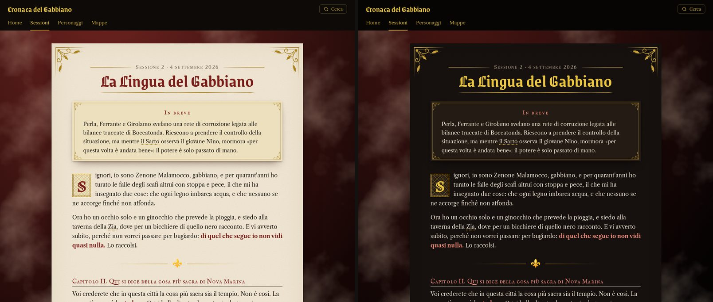
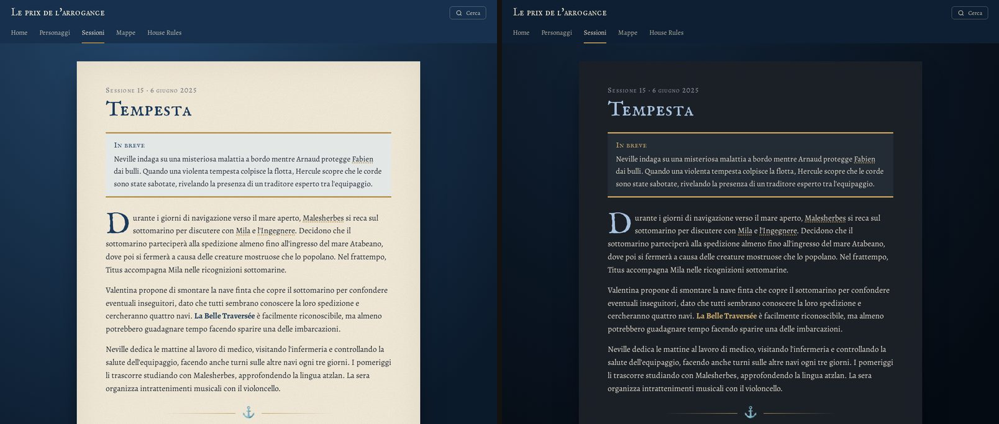
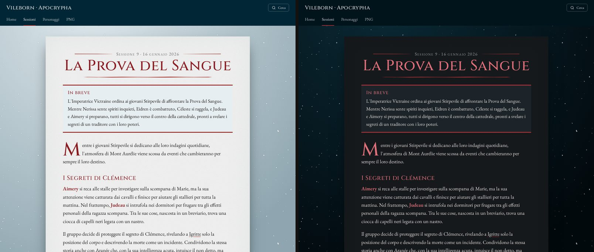

# zensical-ttrpg

A theme for tabletop RPG campaign sites (session reports, characters, maps)
built with [Zensical](https://zensical.org). It sits on top of Zensical's own
theme, in its classic variant, and turns it into a campaign journal: each page
is a sheet of paper over a backdrop, with a timeline of sessions, character
boxes with portraits, a home page that points at the latest session, and a
full-screen map viewer.

It was inspired by [torillic](https://github.com/TEParsons/mkdocs-torillic),
the D&D 5e theme for MkDocs, and made for Italian campaigns, so the interface
speaks Italian or English, following `theme.language`.



## What it does

- **Pages**: one readable column (about 70 characters), no sidebars on wide
  screens, the usual drawer menu on phones, previous/next links at the bottom.
- **Session pages**: a line with the session number and date above the title,
  the excerpt in a summary box under it, a drop cap, and scene breaks (`---`)
  drawn as ornaments.
- **The sessions page**: a timeline, newest first, with dates, excerpts and a
  "new" badge on the latest session.
- **Character pages**: an identity box beside the text, with the portrait on top.
- **Home page**: the latest session, the characters with their portraits, and
  the map.
- **Images**: a link around an image that points to an image file (a map)
  opens it full screen, with zoom, pinch and pan.
- **Tooltips**: names from a glossary show a short description on hover.
- **Palettes**: colours, backdrop, paper grain and scene-break ornaments come
  from a palette: `marina`, `sangue-e-neve` and `oro-di-copertina` so far. A
  light and a dark scheme each, with a toggle.
- **Book-like touches**, each optional: centred titles, as on a book's chapter
  openings; subheadings as rubrics; an illuminated drop cap; filigree in the
  corners of the page; raised boxes with corner ornaments.

## Install

The theme is a Python package. Add it to your `requirements.txt` next to
Zensical, from a release tag:

```text
zensical==0.0.62
zensical-ttrpg @ https://github.com/Stevesibilia/zensical-ttrpg/archive/refs/tags/v0.5.0.tar.gz
```

No git is needed to install it, so it works in slim Docker images.

## Configure

In `mkdocs.yml` (Zensical reads it as it is):

```yaml
theme:
  name: ttrpg
  language: it # or en: the interface text follows it
  font:
    text: Alegreya
    code: Source Code Pro
  palette: # the first scheme is the default
    - scheme: slate
      primary: custom
      accent: custom
      toggle:
        icon: material/weather-sunny
        name: Passa a Giorno
    - scheme: default
      primary: custom
      accent: custom
      toggle:
        icon: material/candle
        name: Passa a Candela
  features:
    - navigation.tabs
    - navigation.footer
    - navigation.top
    - content.tooltips
    - search.highlight

extra:
  ttrpg:
    palette: marina # a file in assets/stylesheets/palettes/
    heading_font: IM Fell English SC # any Google Fonts family, or false
    title: left # or centered
    codex: characters/npcs/ # optional: glossary names link here

markdown_extensions:
  - abbr
  - attr_list
  - md_in_html
  - def_list
  - pymdownx.snippets:
      auto_append:
        - includes/glossario.md # the glossary; skipped while missing
```

`primary: custom` and `accent: custom` hand the colours over to the palette.

### Style options

More options under `extra.ttrpg`, all off by default:

```yaml
extra:
  ttrpg:
    heading_weight: 600 # the weight of heading_font to load
    subheading_font: IM Fell English SC # a Google Fonts family for h2 to h4
    subheadings: rubric # h2 to h4 in the bold colour, over a dark rule
    drop_cap: illuminated # the drop cap in a box with a double rule
    corners: filigree # an ornament in each corner of the page
    boxes: cartouche # boxes raised off the page, with corner ornaments
```

Without `subheading_font`, h2 to h4 use the heading font. `boxes: cartouche`
applies to the summary box, quotes (`>`), the identity box and the latest
session on the home page. The corners show from tablet width up, where the
page is a sheet of paper.

## Writing pages

### Sessions

A session page is a page with `session` in its front matter:

```markdown
---
session: 15
date: 2025-06-06
excerpt: "Neville investigates a strange illness on board while a storm hits the fleet."
---

# The Storm

The story...
```

`date` and `excerpt` are optional. The first page of the section that holds
the sessions (its `index.md`) lists them as a timeline, in reverse nav order,
so list them oldest first in your nav.

A `---` between two paragraphs becomes a scene break. Leave a blank line
above it, or Markdown reads the paragraph above as a heading.

### Characters

A character page gives its portrait in the front matter, as a path from the
docs folder, and wraps its identity fields in a box:

```markdown
---
portrait: characters/images/arnaud.webp
---

# Arnaud de Saint-Raveneaux

<aside class="ttrpg-infobox" markdown>

Nationality
: Montaigne

Profession
: Mercenary and duellist

</aside>

The rest of the page...
```

The portrait is placed at the top of the box; a page with a portrait and no
box gets the portrait on its own, beside the text. A character without a
portrait can say `character: true` to still appear on the home page, with its
initial. A list of sayings can go in `<div class="ttrpg-quotes" markdown>`.

### The home page

```markdown
---
hub: true
contents: none
map: maps/images/theah.webp
map_thumbnail: maps/images/theah_small.webp
---

# My Campaign

A line or two about it.
```

With `hub: true` the page shows the latest session, every character (a page
with a `portrait` or `character: true`, up to three levels deep in the nav),
and the map, which opens full screen on click.

### Section pages

The first page of a section lists the other pages of that section, or the
session timeline. `contents: none` in its front matter turns that off.

### Glossary tooltips

A glossary file holds one abbreviation per line:

```markdown
*[Malesherbes]: Viscount and scholar of Aztlan culture, on the expedition.
```

With `abbr` and `pymdownx.snippets` set up as above, every occurrence of the
name, on every page, shows the description on hover. The match is exact and
longest-first; keep common words out.

With a codex page, the names also link to it:

```yaml
extra:
  ttrpg:
    codex: characters/npcs/ # the codex page, from the docs folder
```

Each name in the text (not in headings, not already in a link) becomes a link
to that page, at the anchor named after it: the name lowercased, accents
removed, and every run of other characters turned into a dash
(`Loïc du Kervern` → `#loic-du-kervern`, `l'Ingegnere` → `#l-ingegnere`). Give
the codex page one anchor per name and alias, before its heading:

```markdown
<a id="janina-la-kobolda-heilsberg"></a>
<a id="janina"></a>

### Janina "la Kobolda" Heilsberg
```

A name with no anchor lands at the top of the page. The codex page itself is
left alone.

## Palettes

| Palette            | Light                                         | Dark                             | Backdrop                             | Ornaments | Pairs with                                                                                          |
| ------------------ | --------------------------------------------- | -------------------------------- | ------------------------------------ | --------- | --------------------------------------------------------------------------------------------------- |
| `marina`           | navy and brass on parchment                   | pale blue and brass on slate     | the sea, seen from a plane           | ⚓ ✥      | IM Fell English SC, Alegreya                                                                        |
| `sangue-e-neve`    | crimson on cold white, petrol header          | rose-red on night, petrol header | falling snow                         | ☾ ✠       | Cinzel, EB Garamond, `title: centered`                                                              |
| `oro-di-copertina` | blood red on parchment, black and gold header | gold on near-black               | an oil glaze, warm glows in the dark | ⚜ ❦       | Grenze Gotisch (600), Libre Caslon Text, IM Fell English SC for subheadings, and every style option |

A session page in each palette, light scheme on the left and dark on the
right. These come from the mock-ups the palettes were chosen on, with text
from real campaigns, so a detail or two differs from the theme.

`marina`, for a 7th Sea campaign:



`sangue-e-neve`, for a Vileborn campaign:



`oro-di-copertina`, for a Historia campaign:


### Your own palette

Set `palette: none` and add a stylesheet through `extra_css` that sets the
tokens for both schemes; `zensical_ttrpg/assets/stylesheets/palettes/marina.css`
is the one to copy:

```css
[data-md-color-scheme="default"] {
  --ttrpg-paper: #f7f1e3; /* the page */
  --ttrpg-ink: #1d2530; /* text */
  --ttrpg-ink-rgb: 29, 37, 48; /* the same, for translucent greys */
  --ttrpg-muted: #5a6573; /* dates, labels */
  --ttrpg-head: #1b3a5c; /* headings, links */
  --ttrpg-strong: #1b3a5c; /* bold, badges */
  --ttrpg-brass: #b58f45; /* rules and ornaments, never text */
  --ttrpg-box: #e3e7e6; /* boxes, table stripes */
  --ttrpg-rule: #b58f45; /* box borders */
  --ttrpg-bar: #16304d; /* header, tabs, footer */
  --ttrpg-bar-ink: #f4ecd8; /* their text */
  --ttrpg-backdrop-1: #24476b; /* backdrop gradient, lit side */
  --ttrpg-backdrop-2: #0b1a2b; /* backdrop gradient, dark side */
  --ttrpg-grain: 0.45; /* paper grain opacity */
  --ttrpg-grain-blend: multiply;
}

[data-md-color-scheme="slate"] {
  /* the same tokens, for the dark scheme */
}
```

Optional tokens, for either scheme or both:

```css
--ttrpg-backdrop-texture: url(...); /* over the gradient; none by default */
--ttrpg-backdrop-size: 560px; /* its tile size */
--ttrpg-ornament-1: "\2766"; /* scene breaks take turns between */
--ttrpg-ornament-2: "\2766"; /* these two glyphs */
--ttrpg-paper-texture: url(...); /* the paper grain; warm noise by default */
--ttrpg-vignette: rgba(80, 55, 25, 0.18); /* shadow at the page edges */
--ttrpg-text-size: clamp(17px, 0.9rem, 19px);
--ttrpg-lift: rgba(40, 20, 5, 0.45); /* shadow under raised boxes */
--ttrpg-corners: url(...); /* page corners, all four in one image */
--ttrpg-box-corners: url(...); /* box corners, the same way */
```

The corner images are masks: only their shape counts, and they take the
colour of `--ttrpg-brass`.

New palettes are welcome as pull requests: one file in
`assets/stylesheets/palettes/`, and a line in the table above.

## Example

`example/` is a small campaign site on the theme, in English. Build it with:

```sh
pip install .
cd example && zensical build
```

## Credits

- [torillic](https://github.com/TEParsons/mkdocs-torillic) by Todd Parsons
  (CC0), for the idea of a campaign site that reads like a book.
- [Zensical](https://zensical.org), which does all the heavy lifting.
- The IM Fell types, digitised by Igino Marini (SIL Open Font License), and
  Alegreya by Juan Pablo del Peral (SIL Open Font License), both loaded from
  Google Fonts.

## License

MIT
